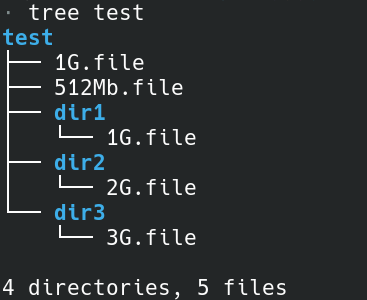
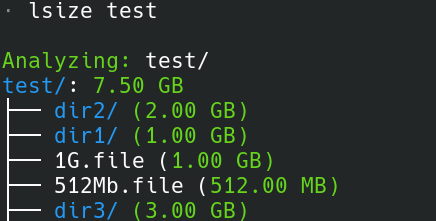

<!-- # lsize -->

```pre 
.__         .__               
|  |   _____|__|_______ ____  
|  |  /  ___/  \___   // __ \ 
|  |__\___ \|  |/    /\  ___/ 
|____/____  >__/_____ \\___  >
          \/         \/    \/              
```

A Python CLI tool to calculate and display the total size of files and directories in Linux.

<p>


</p>

## Features

- Calculates the total size of files and directories recursively.
- Provides a clear, human-readable output of sizes in bytes, KB, MB, and GB.
- Supports both file and directory size reporting.
- Simple, fast, and lightweight (No External Dependency).

## Usage

```bash
lsize <path>
```

Example:
```bash
lsize /home/user/documents
```

This will display the total size of all files and subdirectories under the specified path.

## Installation

```bash
Requires python 3.13.5 or above.
```

```bash
git clone https://github.com/thelearn-tech/lsize
cd lsize
chmod +x install.sh
./install.sh
```


## Example

Here is the structure of a dir `test` and the file names correspond to the file sizes.



Running `lsize` on this dir.



## Contributing

Contributions are welcome! Please open an issue or submit a pull request.

## License

MIT License